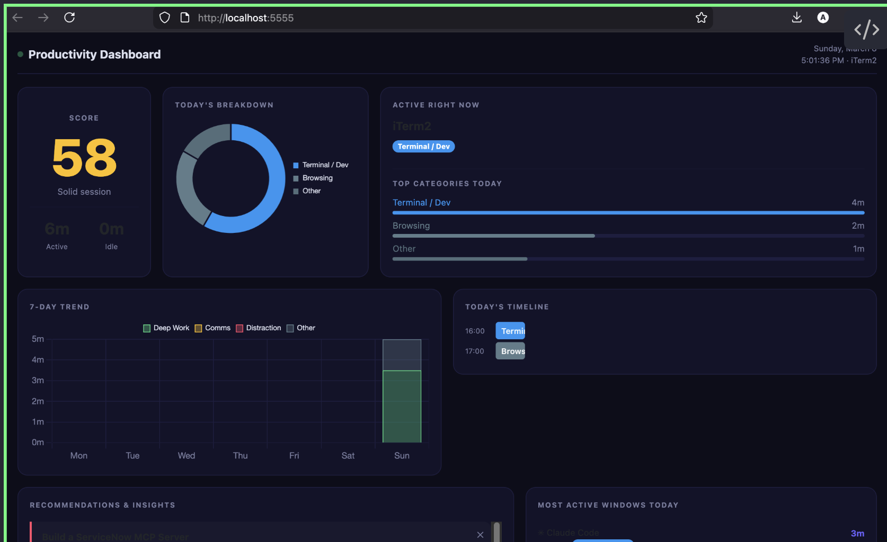

# Productivity Monitor

A lightweight, self-hosted activity monitor and productivity dashboard for your personal computer. Runs silently in the background, tracks which applications and windows you use, and presents the data in a local web dashboard with automatic insights and tool recommendations.

No data leaves your machine. No accounts. No subscriptions.



---

## What it does

- **Monitors** which app is in focus every 30 seconds and logs it to a local SQLite database
- **Categorises** activity automatically (Deep Work, Terminal, Communication, Distraction, etc.)
- **Detects idle time** so AFK periods don't inflate your numbers
- **Serves a dashboard** at `http://localhost:5555` showing:
  - Live productivity score (0–100)
  - Today's time breakdown by category (donut chart)
  - 7-day trend (stacked bar chart)
  - Hourly timeline of today
  - Most active windows and apps
  - Recommendations and insights panel
- **Generates recommendations** hourly based on your actual usage patterns (distraction rate, context switching, peak hours, etc.)
- **Syncs recommendations** between machines via any shared folder you already have

---

## System Requirements

### All platforms
- **Python 3.9 or newer**
  - macOS: pre-installed. Verify: `python3 --version`
  - Linux: pre-installed on most distros. Verify: `python3 --version`
  - Windows: download from [python.org](https://www.python.org/downloads/) — check "Add Python to PATH" during install
- **pip** (comes with Python)
- **Git** (to clone the repository)
  - macOS: `xcode-select --install`
  - Linux: `sudo apt install git` or `sudo dnf install git`
  - Windows: [git-scm.com](https://git-scm.com/download/win)
- ~50 MB disk space for the app + database over time

### macOS (12 Ventura or newer)
- Accessibility permission for Terminal (granted during setup — details below)

### Linux (X11 desktop environments)
- `xdotool` — for reading the active window name
  ```bash
  sudo apt install xdotool          # Ubuntu / Debian / Mint
  sudo dnf install xdotool          # Fedora / RHEL
  sudo pacman -S xdotool            # Arch / Manjaro
  ```
- `xprintidle` — optional, enables idle time detection
  ```bash
  sudo apt install xprintidle       # Ubuntu / Debian
  ```
- Wayland note: `xdotool` requires XWayland. Most Wayland desktops include it; if app names show as "unknown", verify XWayland is running.

### Windows (10 or 11)
- `pywin32` and `psutil` — installed automatically by `install.py`
- Python must be in your system PATH (select this option during Python installation)

---

## Installation

### Step 1 — Clone the repository

Open a terminal (Terminal on macOS/Linux, Command Prompt or PowerShell on Windows) and run:

```bash
git clone https://github.com/autisticcaveman/productivity-monitor.git
cd productivity-monitor
```

### Step 2 — Run the installer

```bash
python3 install.py          # macOS / Linux
python  install.py          # Windows
```

The installer will ask you a few questions:

| Prompt | What to enter | Default |
|--------|--------------|---------|
| Data directory | Where to store your activity database and logs | OS-appropriate (see below) |
| Dashboard port | Port for the web dashboard | `5555` |
| Poll interval | How often to check the active app (seconds) | `30` |
| Idle threshold | Seconds of inactivity before marking as idle | `300` (5 min) |
| Enable sync | Whether to sync recommendations across machines | `n` |
| Sync folder | Path to a shared folder (if sync enabled) | — |

**Default data directories:**

| OS | Default path |
|----|-------------|
| macOS | `~/Library/Application Support/productivity-monitor/` |
| Linux | `~/.local/share/productivity-monitor/` |
| Windows | `%APPDATA%\productivity-monitor\` |

To accept all defaults without being prompted:
```bash
python3 install.py --defaults
```

### Step 3 — Grant permissions (macOS only)

The monitor uses macOS Accessibility APIs to read the active window name. You need to grant this once:

1. Open **System Settings**
2. Go to **Privacy & Security → Accessibility**
3. Click the **+** button
4. Add **Terminal** (or iTerm2, Warp, or whichever terminal you use)
5. Ensure the toggle next to it is **ON**

Without this, the monitor still runs but app names will show as "unknown".

### Step 4 — Open the dashboard

Navigate to **[http://localhost:5555](http://localhost:5555)** in any browser.

The green pulsing dot in the top-left confirms the monitor is active. Data appears within 30 seconds of the first poll.

---

## Configuration

All settings live in `config.json` in the project root. Edit this file and re-run `python3 install.py` to apply changes.

```json
{
  "data_dir":               "/path/to/your/data",
  "dashboard_port":         5555,
  "poll_interval_seconds":  30,
  "idle_threshold_seconds": 300,
  "sync_enabled":           false,
  "sync_path":              ""
}
```

| Key | Description |
|-----|-------------|
| `data_dir` | Where `activity.db` and logs are stored. Can be any writable path. |
| `dashboard_port` | Port for the web dashboard. Change if 5555 conflicts with something else. |
| `poll_interval_seconds` | How often the monitor checks the active app. Lower = more granular, higher CPU. |
| `idle_threshold_seconds` | Inactivity duration before a period is marked idle instead of active. |
| `sync_enabled` | Set to `true` to enable recommendation syncing between machines. |
| `sync_path` | Path to any shared folder (Obsidian vault, Dropbox, OneDrive, network share). |

### Customising app categories

Edit `categories.json` to control how apps are categorised. Each entry follows this structure:

```json
"deep_work": {
  "label": "Deep Work",
  "color": "#4CAF50",
  "apps": ["code", "cursor", "xcode", "pycharm"],
  "window_overrides": [
    {
      "keywords": ["github", "stackoverflow", "docs"],
      "category": "deep_work"
    }
  ]
}
```

- **`apps`** — partial matches against the app process name (case-insensitive)
- **`window_overrides`** — when an app (e.g. Chrome) matches multiple categories, window title keywords break the tie. Checked in order; first match wins.

Built-in categories: `deep_work`, `terminal`, `communication`, `documentation`, `ai_tools`, `browsing`, `planning`, `meetings`, `distraction`, `creative`, `system`, `idle`, `uncategorized`.

---

## Using the Dashboard

Open **[http://localhost:5555](http://localhost:5555)** in any browser. The page auto-refreshes every 60 seconds.

### Productivity Score

A 0–100 score calculated from today's active time:

- **Adds** to score: Deep Work, Terminal, Documentation, Planning, AI Tools
- **Subtracts** from score: Distraction
- **Neutral**: Communication, Browsing, Meetings, System

| Score | Label |
|-------|-------|
| 85–100 | Absolutely crushing it |
| 70–84 | In the zone |
| 55–69 | Solid session |
| 40–54 | Decent — room to improve |
| 25–39 | Fragmented day |
| 10–24 | Off track |
| 0–9 | Not much tracked yet |

### Recommendations Panel

Pre-seeded with tool and workflow suggestions on first run. Additional data-driven recommendations are generated automatically every hour once you have enough usage history (~1 hour of data). Dismiss any recommendation with the **✕** button — dismissed items don't return.

Pattern-based recommendations look for:
- Distraction rate above 12% of active time
- Deep work below 35% of active time
- Communication consuming more than 35% of active time
- Context switching faster than 5 category changes per hour
- Heavy browser use without a local docs solution
- Your personal peak productivity hour

---

## Running on Multiple Machines

### Option A — Git clone on each machine (recommended)

Each machine clones the repo and runs `install.py` independently. Activity data stays local to each machine. Recommendations can optionally be shared.

```bash
git clone https://github.com/autisticcaveman/productivity-monitor.git
cd productivity-monitor
python3 install.py
```

### Option B — Deploy from source machine (macOS/Linux only)

If you already have it running on one Mac and want to push it to another:

```bash
# Edit .deployrc with the remote Mac's address first
bash deploy.sh
```

See [DEPLOY.md](DEPLOY.md) for the full step-by-step guide with no assumed knowledge.

### Syncing recommendations between machines

Recommendations (tool suggestions, workflow insights) are the only state worth sharing across machines — activity data is machine-specific.

**1. Configure a shared sync folder in `config.json`** on each machine:

```json
{
  "sync_enabled": true,
  "sync_path": "/path/to/shared/folder"
}
```

The `sync_path` can be anything both machines can access:
- An Obsidian vault synced via iCloud / Obsidian Sync
- A Dropbox or OneDrive folder
- A network share (`/Volumes/nas/shared` or `\\server\share`)
- Any folder you keep in sync yourself

**2. Export from the source machine:**
```bash
python3 sync.py export
```

**3. Import on the destination machine:**
```bash
python3 sync.py import
```

**Other sync commands:**
```bash
python3 sync.py status    # show what's in the sync file
python3 sync.py path      # print the resolved sync file path
```

---

## Keeping it Updated

Pull the latest changes and restart services:

```bash
cd productivity-monitor
git pull
python3 install.py --defaults
```

Your `config.json` and `data/` are preserved across updates.

---

## Uninstalling

```bash
python3 uninstall.py
```

This stops both background services and removes their auto-start entries. Your activity database is preserved — delete the `data_dir` folder manually if you want a clean slate.

---

## Troubleshooting

### Dashboard shows "Monitor not running"
The monitor service isn't active. Re-run the installer:
```bash
python3 install.py --defaults
```
Or check the error log in your configured `data_dir`:
```bash
# macOS/Linux
cat ~/Library/Application\ Support/productivity-monitor/monitor-err.log

# Windows (PowerShell)
type "$env:APPDATA\productivity-monitor\monitor-err.log"
```

### App names show as "unknown" (macOS)
Accessibility permission isn't granted or hasn't taken effect.
- System Settings → Privacy & Security → Accessibility → verify Terminal is listed and toggled ON
- If it's already there, remove it and re-add it
- Wait 60 seconds after granting, then refresh the dashboard

### App names show as "unknown" (Linux)
`xdotool` isn't installed or isn't finding the active window.
```bash
xdotool getactivewindow getwindowname    # test it manually
sudo apt install xdotool                 # install if missing
```
On Wayland: verify XWayland is running — `echo $WAYLAND_DISPLAY` should return a value, and `xdotool` should still work via XWayland compatibility.

### Dashboard won't load at localhost:5555
Check if the dashboard process is running:
```bash
# macOS/Linux
ps aux | grep "dashboard/app.py" | grep -v grep

# Windows (PowerShell)
Get-Process python | Where-Object { $_.CommandLine -like "*app.py*" }
```
If nothing appears, restart with:
```bash
python3 install.py --defaults
```
If another app is using port 5555, change `dashboard_port` in `config.json` and re-run the installer.

### "python3: command not found" (Windows)
Python isn't in your PATH. Either:
- Reinstall Python from [python.org](https://www.python.org/downloads/) and tick "Add Python to PATH"
- Or use the full path: `C:\Users\YourName\AppData\Local\Programs\Python\Python3x\python.exe install.py`

### Flask import error
```bash
pip3 install flask                          # macOS / Linux
pip install flask                           # Windows
python3 install.py --defaults               # then restart
```

### Services don't start after a reboot (Linux)
systemd user services require user lingering to start without a login session:
```bash
loginctl enable-linger $USER
```

### Sync import finds nothing new
- Confirm the source machine ran `python3 sync.py export` after the recommendations were added
- Check the sync file exists: `python3 sync.py path`
- Verify both machines point to the same physical folder

---

## File Reference

```
productivity-monitor/
├── monitor.py          Background daemon — polls active app every 30s
├── dashboard/
│   ├── app.py          Flask web server — dashboard at localhost:5555
│   └── templates/
│       └── index.html  Dashboard UI (Bootstrap 5 + Chart.js, dark theme)
├── analyze.py          Hourly pattern analysis → generates recommendations
├── categories.json     App → productivity category mappings (edit freely)
├── config.json         Your settings — data path, port, sync, intervals
├── config_loader.py    Reads config.json, provides defaults per OS
├── platform_utils.py   OS abstraction — app detection + idle time
├── install.py          Cross-platform installer (macOS / Linux / Windows)
├── uninstall.py        Cross-platform service removal
├── sync.py             Recommendation sync via shared folder
├── requirements.txt    Python dependencies
├── deploy.sh           Push to remote Mac via rsync + SSH (macOS/Linux)
├── vault-sync.sh       Legacy bash sync script (macOS only — use sync.py instead)
├── install.sh          Legacy bash installer (macOS only — use install.py instead)
├── uninstall.sh        Legacy bash uninstaller (macOS only — use uninstall.py instead)
├── DEPLOY.md           Beginner-friendly multi-Mac deployment guide
└── data/               Created on first run — never committed to git
    ├── activity.db     SQLite database — all your activity data
    ├── monitor.log     Monitor daemon log
    └── *.log           Service output/error logs
```

---

## Privacy

Everything stays local:
- No network calls except serving the dashboard on `localhost`
- No telemetry, analytics, or external APIs
- The SQLite database is stored wherever you configure `data_dir`
- `data/` is excluded from git via `.gitignore` — your activity is never committed

---

## License

MIT
